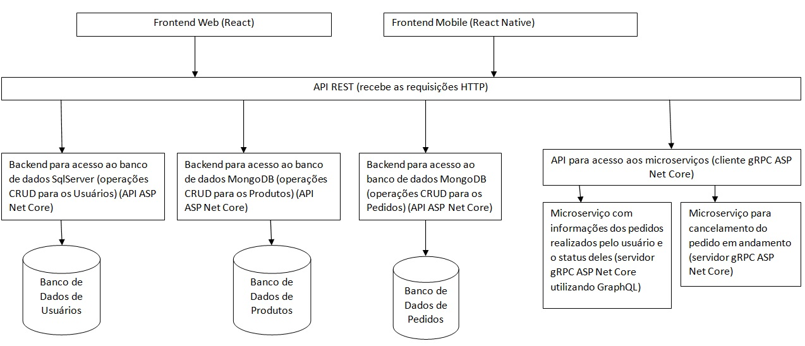
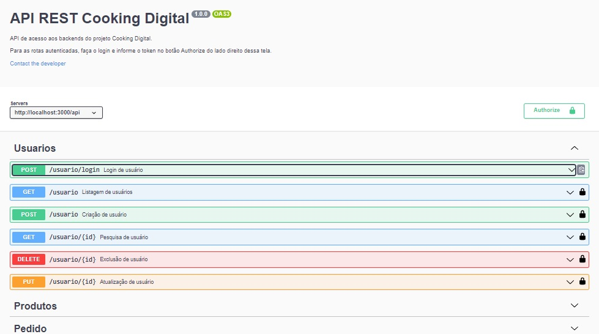

# Arquitetura da Solução

Utilizaremos no nosso projeto o estilo arquitetural de microserviços.

Definição: Este estilo arquitetural coloca prioridade no desacoplamento entre serviços através da definição de domínios de aplicação que são independentes de outros, em termos de código fonte e esquemas de banco de dados. Baseia-se no conceito de contexto limitado, onde em cada contexto são acoplados código e esquemas de forma coesa, mas sem acoplamento com contextos externos. Desta forma, os serviços são menos complexos que em outros estilos arquiteturais.

Microserviços formam uma arquitetura distribuída, cada serviço roda em processo próprio em uma máquina específica (mesmo que virtualizada ou em um container).

Componentes:

1. Cliente: um aplicativo móvel e web que permite aos usuários fazer pedidos de comida em um restaurante cadastrado específico.

2. Servidores de aplicação: uma camada de servidores que processa as solicitações dos clientes e se comunica com os outros componentes da arquitetura.

3. Bancos de dados distribuídos: bancos de dados espalhados por vários servidores que armazenam informações de pedidos, cardápios, usuários e outros dados relevantes.

4. API REST.
Cada serviço será acessado por uma API (Interface de Programação de Aplicações) utilizando mecanismos de acesso a serviços Web - REST (REpresentational State Transfer).

5. Gerenciamento de dados:
Os dados são armazenados em bancos de dados distribuídos, garantindo a integridade e consistência dos dados em todos os componentes da arquitetura.

6. Segurança:
O sistema deve ter medidas de segurança adequadas, como autenticação e autorização de usuários, criptografia de senhas, proteção contra ataques de rede e vazamento de informações sensíveis.

7. Escalabilidade:
A arquitetura de software distribuído é projetada para ser escalável, permitindo que o sistema seja expandido facilmente para lidar com um grande número de usuários.

## Arquitetura do Software Distribuído

## Diagrama de Casos de Uso

Identificação dos usuários do sistema:
* Administrador
* Usuário de manutenção no site - Usuário responsável pelas atualizações cadastrais
* Clientes do restaurante
* Atendente do restaurante

Casos de uso:

1. O administrador do sistema cadastra o Usuário de manutenção responsável pelo cadastro de produtos
2. O Usuário de manutenção cadastra os produtos disponíveis para venda
3. O Usuário de manutenção atualiza os produtos disponíveis para venda
4. O Usuário de manutenção exclui produtos disponíveis para venda
5. O cliente cadastra o seu próprio usuário
6. O cliente cadastra o seu pedido
7. O sistema avisa sobre o novo pedido cadastrado ao Atendente
8. O Atendente coloca o pedido no Status "em Andamento"
9. O cliente poderá cancelar um pedido desde que ele não tenha sido iniciado, ou seja, o pedido não poderá ser cancelado
se estiver no status "em Andamento"
10. O Atendente finaliza o pedido

## Diagrama de Classes

O diagrama de classes ilustra graficamente como será a estrutura do software, e como cada uma das classes da sua estrutura estarão interligadas. Essas classes servem de modelo para materializar os objetos que executarão na memória.

As referências abaixo irão auxiliá-lo na geração do artefato “Diagrama de Classes”.

> - [Diagramas de Classes - Documentação da IBM](https://www.ibm.com/docs/pt-br/rational-soft-arch/9.6.1?topic=diagrams-class)
> - [O que é um diagrama de classe UML? | Lucidchart](https://www.lucidchart.com/pages/pt/o-que-e-diagrama-de-classe-uml)

## Modelo ER

O Modelo ER representa através de um diagrama como as entidades (coisas, objetos) se relacionam entre si na aplicação interativa.]

As referências abaixo irão auxiliá-lo na geração do artefato “Modelo ER”.

> - [Como fazer um diagrama entidade relacionamento | Lucidchart](https://www.lucidchart.com/pages/pt/como-fazer-um-diagrama-entidade-relacionamento)

## Esquema Relacional

O Esquema Relacional corresponde à representação dos dados em tabelas juntamente com as restrições de integridade e chave primária.
 
As referências abaixo irão auxiliá-lo na geração do artefato “Esquema Relacional”.

> - [Criando um modelo relacional - Documentação da IBM](https://www.ibm.com/docs/pt-br/cognos-analytics/10.2.2?topic=designer-creating-relational-model)

## Modelo Físico

Entregar um arquivo banco.sql contendo os scripts de criação das tabelas do banco de dados. Este arquivo deverá ser incluído dentro da pasta src\bd.

## Tecnologias Utilizadas

Para o desenvolvimento da aplicação será utilizado:
* Frontend Web >  React
* Backend > ASP Net Core Web API
* Frontend Mobile > React Native
* IDE > Visual Studio 2022 e Vs Code
* API REST > NodeJs
* Banco de dados > SQL Server e MongoDB

### Documentação das API's

O projeto é composto por três backends desenvolvidos com o ASP Net Core:
* Users API
* Poducts API
* Order API e
* Uma API orquestradora denominada API REST Cooking Digital.  
A documentação swagger da API REST contém a documentação de todos os endpoints de acesso aos demais backends.  
Veja na figura abaixo:

Caso a API REST esteja em execução localmente, o acesso à documentação pode ser realizado pelo navegador no link: http://localhost:3000/api-docs/ 

## Hospedagem

Explique como a hospedagem e o lançamento da plataforma foi feita.

> **Links Úteis**:
>
> - [Website com GitHub Pages](https://pages.github.com/)
> - [Programação colaborativa com Repl.it](https://repl.it/)
> - [Getting Started with Heroku](https://devcenter.heroku.com/start)
> - [Publicando Seu Site No Heroku](http://pythonclub.com.br/publicando-seu-hello-world-no-heroku.html)

## Qualidade de Software

Conceituar qualidade de fato é uma tarefa complexa, mas ela pode ser vista como um método gerencial que através de procedimentos disseminados por toda a organização, busca garantir um produto final que satisfaça às expectativas dos stakeholders.

No contexto de desenvolvimento de software, qualidade pode ser entendida como um conjunto de características a serem satisfeitas, de modo que o produto de software atenda às necessidades de seus usuários. Entretanto, tal nível de satisfação nem sempre é alcançado de forma espontânea, devendo ser continuamente construído. Assim, a qualidade do produto depende fortemente do seu respectivo processo de desenvolvimento.

A norma internacional ISO/IEC 25010, que é uma atualização da ISO/IEC 9126, define oito características e 30 subcaracterísticas de qualidade para produtos de software.
Com base nessas características e nas respectivas sub-características, identifique as sub-características que sua equipe utilizará como base para nortear o desenvolvimento do projeto de software considerando-se alguns aspectos simples de qualidade. Justifique as subcaracterísticas escolhidas pelo time e elenque as métricas que permitirão a equipe avaliar os objetos de interesse.

> **Links Úteis**:
>
> - [ISO/IEC 25010:2011 - Systems and software engineering — Systems and software Quality Requirements and Evaluation (SQuaRE) — System and software quality models](https://www.iso.org/standard/35733.html/)
> - [Análise sobre a ISO 9126 – NBR 13596](https://www.tiespecialistas.com.br/analise-sobre-iso-9126-nbr-13596/)
> - [Qualidade de Software - Engenharia de Software 29](https://www.devmedia.com.br/qualidade-de-software-engenharia-de-software-29/18209/)
